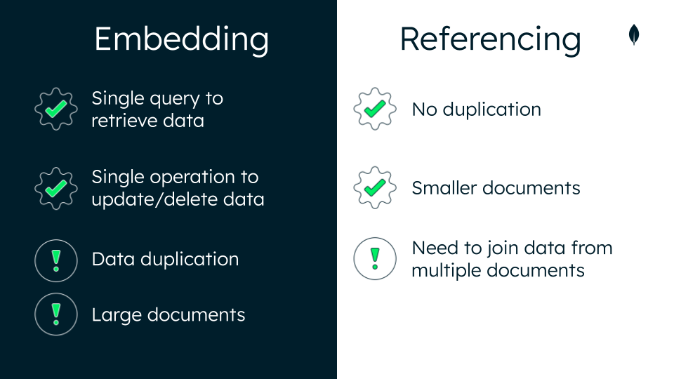

# Referencing
- Sometimes called linking or data normalisation
- No data duplication
- Smaller documents

Cons
- Querying from multiple documents costs extra resources and impacts read performance

